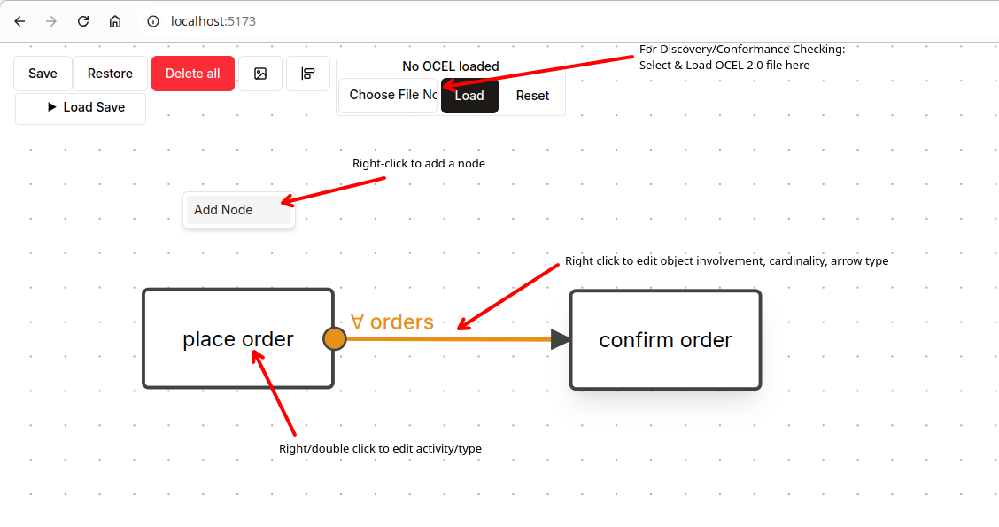
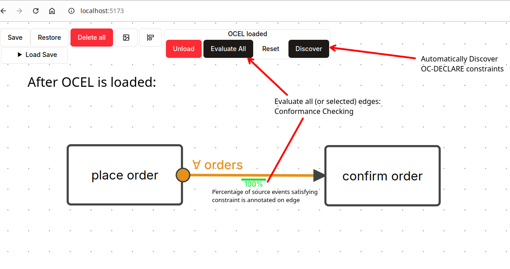
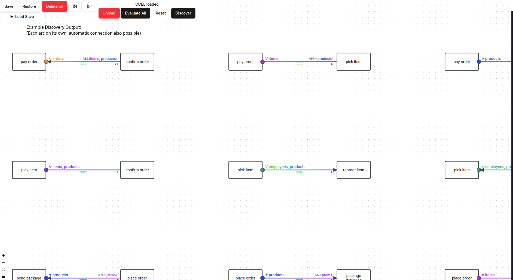

# OC-DECLARE

**Note: The main code of OC-DECLARE is currently being upstreamed to the Rust4PM project and the `process_mining` crate.
See also https://github.com/aarkue/rust4pm and the https://github.com/aarkue/rust4pm/tree/feat/oc-declare branch.**

This repository contains the following parts:

1. Visual Editor for OC-DECLARE
2. Backend for Conformance Checking and Discovery of OC-DECLARE
3. Evaluation Setup used to evaluate OC-DECLARE
4. Evaluation Dataset and Results for OC-DECLARE

There is an interactive **web demo** of OC-DECLARE available at [**https://oc-declare.vercel.app/**](https://oc-declare.vercel.app/).
It can be used directly in your browser and without installing anything. Note, that the web version is slower and less scalable than running the approach natively. However, it is great for experimenting or quickly trying out the OC-DECLARE implementation.

In the web version, OCEL 2.0 files in the XML and JSON format are supported. Discovery in the web version does not use object-to-object (O2O) relationships.
See [https://www.ocel-standard.org/event-logs/overview/](https://www.ocel-standard.org/event-logs/overview/) for a list of publicly available example datasets.

## Screenshots

---

For the evaluation datasets and raw results see the `evaluation-results/` subfolder. It contains a `raw-results` folder containing all discovered results and execution times (see below for a description).
Additionally, the `evaluation-results/datasets/datasets.zip` can be extracted to get all the OCEL 2.0 files used for evaluation.
The `-results.json` files can also be imported and viewed in the frontend (Load Save -> Select file).

## Details

The backend of the OC-DECLARE approach is implemented in the Rust programming language.
See [https://www.rust-lang.org/tools/install](https://www.rust-lang.org/tools/install) for instructions on how to install Rust on your machine.

### Backend & Evaluation Setup
Conformance Checking and Discovery for OC-DECLARE is implemented in the `shared` crate (`crates/shared`).
The functions `get_for_all_evs_perf` (for conformance checking) and `discover` (for discovery) are probably the most interesting ones.
The shared backend code can be compiled by running `cargo build --release` in the `shared` directory.

The evaluation setup is available in the `evaluation` crate (at `crates/evaluation`).
It can be executed with `cargo run --release -- /path/to/ocel/folder/`, where the appropriate OCEL 2.0 JSON files are expected to be available (e.g., `ContainerLogistics.json`).
The evaluation pipeline will then run through all configurations and place the result files in the current directory (e.g., `crates/evaluation`).
For each configuration (OCEL file and O2O direction), two files are created ending in `-results.json` for JSON representation of all discovered constraints and `-summary.json`, containing only the durations (in seconds), mean duration, and number of results.

### Frontend
The frontend is implemented using web technologies and requires Node.js and npm to be installed on your machine. See [https://docs.npmjs.com/downloading-and-installing-node-js-and-npm](https://docs.npmjs.com/downloading-and-installing-node-js-and-npm) for more information.

To also update and use the backend Rust implementation directly in the browser the crate `backend-wasm` (`crates/backend-wasm`) needs to be build and packaged first.
For that, `wasm-pack` is needed (installable from [https://rustwasm.github.io/wasm-pack/installer/](https://rustwasm.github.io/wasm-pack/installer/)). By running `wasm-pack build --target web --release` in the `crates/backend-wasm` folder, the WASM backend will be bundled to the `crates/backend-wasm/pkg` subfolder.

The frontend lives at the root directory and `src/`. 
First install the needed dependencies using `npm install` inside the root of this repository.
Next, the frontend can be started in development mode using `npm run dev`.
Simply open the printed URL in your browser to use it.
